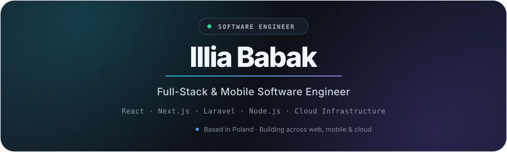
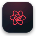
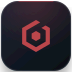
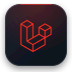
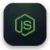

 

&nbsp;&nbsp;

 

## Tech Stack & Tools

### Frontend

  &nbsp;
  &nbsp;
  &nbsp;
  &nbsp;
  &nbsp;
  &nbsp;
  &nbsp;
  

### Backend

  &nbsp;
  &nbsp;
  &nbsp;
  &nbsp;
  

### DevOps & Infrastructure

  &nbsp;
  &nbsp;
  &nbsp;
  &nbsp;
  &nbsp;
  &nbsp;
  

### Mobile

  &nbsp;
  

### Databases

  &nbsp;
  &nbsp;
  &nbsp;
  &nbsp;
  &nbsp;
  

### Testing

  &nbsp;
  &nbsp;
  &nbsp;
  

 

## GitHub Activity

<picture>
  <source media="(prefers-color-scheme: dark)" srcset="https://github-readme-stats.vercel.app/api?username=illiaBabak&show_icons=true&hide_border=true&bg_color=00000000&title_color=E6EDF3&icon_color=60A5FA&text_color=8B949E&count_private=true&include_all_commits=true" />
  <source media="(prefers-color-scheme: light)" srcset="https://github-readme-stats.vercel.app/api?username=illiaBabak&show_icons=true&hide_border=true&title_color=1F2937&icon_color=2563EB&text_color=4B5563&count_private=true&include_all_commits=true" />
  
</picture>

<picture>
  <source media="(prefers-color-scheme: dark)" srcset="https://streak-stats.demolab.com?user=illiaBabak&hide_border=true&background=00000000&ring=60A5FA&fire=A78BFA&currStreakLabel=E6EDF3&sideLabels=8B949E&currStreakNum=E6EDF3&sideNums=8B949E&dates=6E7681" />
  <source media="(prefers-color-scheme: light)" srcset="https://streak-stats.demolab.com?user=illiaBabak&hide_border=true&ring=2563EB&fire=7C3AED&currStreakLabel=1F2937&sideLabels=4B5563&currStreakNum=1F2937&sideNums=4B5563" />
  
</picture>

 

  Web systems · Mobile products · Backend architecture · Cloud infrastructure

